## Final Project
This report is intended to explain the work we have done with our final project.
### Authors
* GABRIELE ZAMBRA
* GIORGIO
* JUNHUI LIANG
* YANUIN WANG
* YAZAN SALTI

### Abstract (**5 points**)
Streaming Music Service are nowadays very common, thanks to the internet they are now used everywhere. But now we have more, some services, like Spotify, are sharing data about the users and the songs. The aim of this project is to analyze and study part of this data.

The analysis has been done principally with the usage of the R tool, so after pre-processing the data, we have started to make analysis, generating graphs and machine learning models and make predictions.

In the next section we propose the questions of interest we would like to work with in this project.

### Introduction and Related Work
- What features have TOP100 artists in Europe and China? 
Frankly speaking, there are dozens of datasets and people intended to analyze the musical characteristic rather than artist' feature. Thus, it would be very interesting to place more concerns on the artist themselves.
  
- How have duration, tempo and loudness of songs changed through time? 
In the following analysis I am going to study the "msd" dataset to find out if the duration, the tempo or the loudness of most popular songs have changed over time since the 60' until 2010 or not.
I will working with a dataset from [this](https://github.com/thomasSve/Million-Song-Dataset-Analysis/tree/master/datasets) Project
  
- How are the features of the song are different in the world? 
Make an analysis on how the song's features are different in different country can be done for many reason. For example the artists, could better understand where them song can be successful and where put more effort. It can also be helpful to understand the tastes in different countries.
[link](https://developer.spotify.com/documentation/web-api/reference/tracks/get-audio-features/))
  
- Which are the characteristics of the songs I like? 
Analyzing **the features** of a Spotify playlist with the intent of finding patterns or any statistic significance in them in order to explain the criterion (or the criteria) beneath which a song is liked or not (by me, let's say).
  
- How do the features of music influence the genre of music? 
We would like to understand the relationship between features and different genres of music. The idea is to build a machine learning model between features and the label of each music.

### Exploratory Data Analysis (**20 points**)
- What features have TOP100 artists in Europe and China? 
The dataset, downloaded from [Kaggle](https://www.kaggle.com/pieca111/music-artists-popularity), consists of over 1.4 million musical artists presented in [MusicBrainz](https://musicbrainz.org) database -- their names, tags, and popularity(listeners or scrobbles), based on data scraped from [last.fm](https://www.last.fm).

  
  - **Variable Selection**: First, in term of ***artist***, ***country*** and ***tags***, they all have respectively two columns from different sources including Musicbrainz and last.fm, which is not necessary for data analysis. Therefore, we set the data from last.fm as the reservation for further research.
  - **Variable Drop**: Besides, the variable of ***ambiguous_artist*** is useless for our Question 1, so we will drop this variable. In the column of ***country***, some rows have one more value for country, which should be deleted at the same time.
  - **Other preprocess**: Finally, like the ***NA*** value and duplicate rows, we have to delete them to keep the dataset clean.
  - **Final Features Choose**:  [mbid,artist,country,tags, listeners_lastfm,scrobbles_lastfm]

  - How have duration, tempo and loudness of songs changed through time? 
  The dataset I am working with called msd was downloaded [from this Github project page](https://github.com/thomasSve/Million-Song-Dataset-Analysis/tree/master/datasets) and it is derived from the well known [OneMillionSong dataset](http://millionsongdataset.com/)
  The variables I am interested in form this dataset are:song_hotttnesss, duration, tempo and loudness.

  First I started looking at the correlation between variables by plotting the correlation matrix
   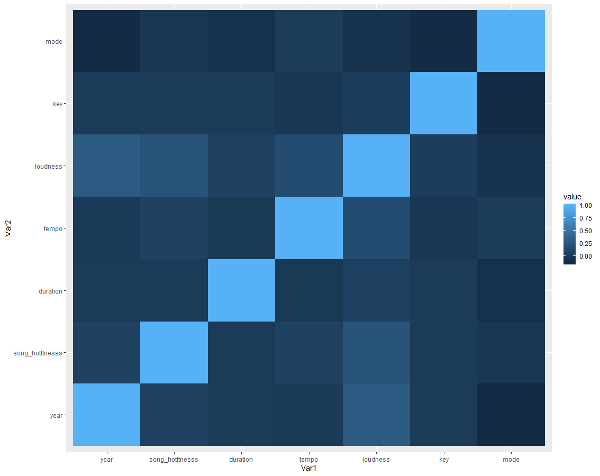
   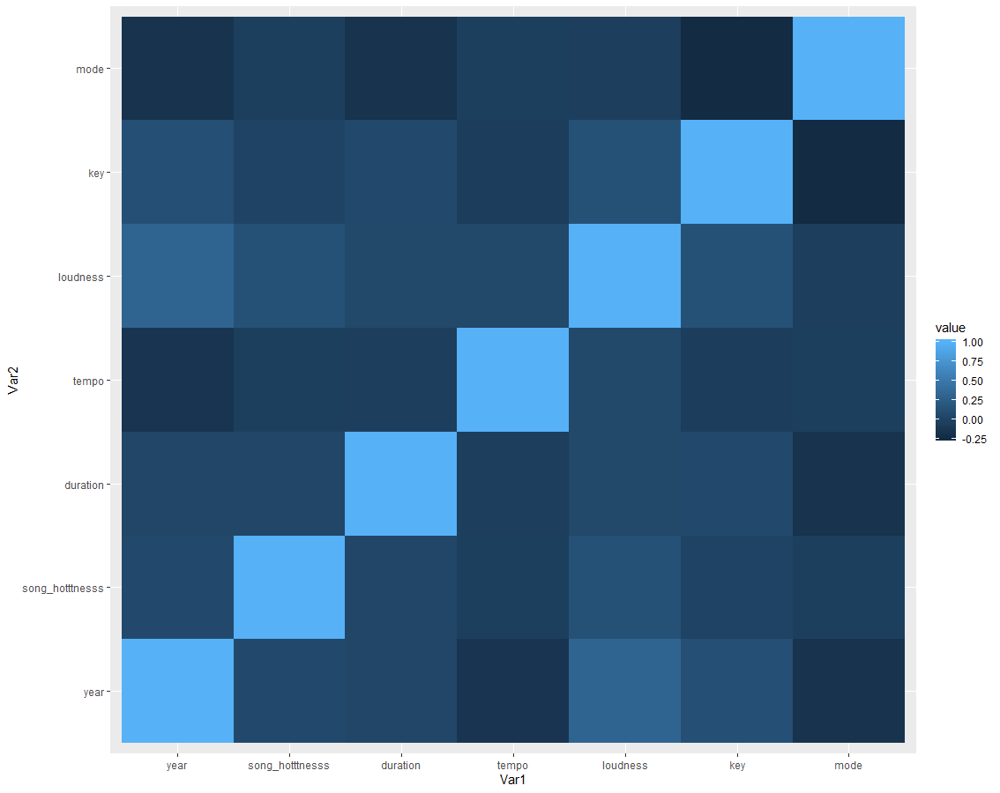
  We can see a slight difference between both figures.
  First when taking all hotness levels into account we see that the variables are not correlated, but after taking only songs with hotness levels more than 0.7 we see that week correlation between the variable year and other variables start to appear.
  We can see that the variable year is most correlated with the variable loudness.

- How are the features of the song are different in the world? 
  We are going to focus on how songs can be characterized in a country. For example expect that the songs of Latin American countries are more danceable than for example those of the north European countries like Norway, Sweden and Finland.
  Our analysis has been done using the Spotify API, in particular we have used the *spotifyr* package of R to access it. We have decide to concentrate our analysis on some specific features:

  - **danceablity**: It describes how suitable a track is for dancing based on a combination of musical elements including tempo, rhythm stability, beat strength, and overall regularity. More higher is the value more the song is danceable.
  - **energy**: Typically, energetic tracks feel fast, loud, and noisy. For example, death metal has high energy, while a Bach prelude scores low on the scale. Perceptual features contributing to this attribute include dynamic range, perceived loudness, timbre, onset rate, and general entropy.
  - **valence**: Tracks with high valence sound more positive (e.g. happy, cheerful, euphoric), while tracks with low valence sound more negative (e.g. sad, depressed, angry)
  - **tempo**: The overall estimated tempo of a track in beats per minute (BPM). In musical terminology, tempo is the speed or pace of a given piece and derives directly from the average beat duration.

  We have chosen the following features for the analysis because these are the ones with the largest standard deviation, so we can found real differences among countries. All the selected features are between the value 0 and 1 (except for tempo), and seems that they are following a normal distribution (as you can see from this .

  I have used a dataset obtained by merging of all datasets of [spotify ranking](https://spotifycharts.com/regional) by country on the 17th of December 2019. For each feature we calculate a mean value of the top 200 songs in each country, we are going to use these values to represent the features in each country.

  For the representation of the features we have decided to use the world data map, that type of visualization for this question is actually perfect. This graph can show us if our neighbour county share the same type taste or not.

  

  From theses four graphs we can see that the Latin American countries seem to prefer more happy and danceable songs, while in Europe we note a consistent difference between the Southern Countries and the Northern Countries, the Southern ones tend to have similar taste as the Latin Americas while the North's songs seem more cold(less danceable). We can note that the North American Countries tends to have the same taste of Australia and New Zealand, obviously more cold  than the Spanish songs but not like North European ones.

- Which are the characteristics of the songs I like? 
  -  The aim of this work is to explore, visualize, analyze with the hope of producing significant results that could encounter the interest of the reader and satisfy its maker. Analyzing **the features** of a Spotify playlist with the intent of finding patterns or any statistic significance in them in order to explain the criterion (or the criteria) beneath which a song is liked or not (by me, let's say).

    This is the structure of the dataset

    .PNG)

    We notice that the first column is a little bit strange, it looks like a replication of the index columns shifted of -1 value (this could be due to a small grammatical error in the dataset or some error in the reading process); to avoid that we could either modify the dataset.csv file (not the best choice since it was taken from external sources), troubleshoot the read function (slow and painful) or mutate it into a new data frame we would use from now on (everything is traced inside the script, this sounds like the best choice).

    This data frame contains pieces of information about music features, all the variables are provided by Spotify itself who then allows us to exploit these great datasets.

    We could find some interesting patterns between the variables and we hope to predict something about their success. A similar work could be found on [this link](https://www.kaggle.com/cihanoklap/top-songs-on-spotify-what-makes-them-popular) and a great study is found at [this link](https://essay.utwente.nl/75422/1/NIJKAMP_BA_IBA.pdf)

    But first of all we want to check the quality of our data, looking for *n/a* values

    

     Apparently we have encountered a good dataset without missing values, in case we would have found them we could have decided to remove them or, if the were quite a lot, deal with other techniques such as average replacing or regression.

    it's clear we are working with too many variables and but this plot could be a good starting point for removing some of them.

    Since we want to understand the ratio behind music features and success we can look for strongly dependent variables and select one of them, or chose a combination in order to reduce cardinality and computational complexity without losing variance.

    Duration range:

    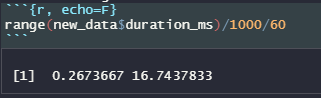

    we could devide the song bye duration into 5 categories: *very short*, *short*, *medium*, *long*, *very long*

    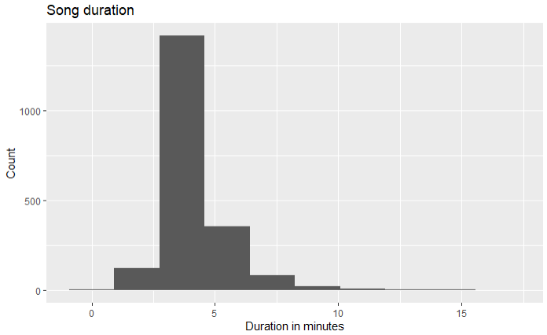

    Since most of the songs appear to be between 2 and 3 minutes it's better to classify them in just 3 categories: *short*, *medium*, *long*. In order to do this we mutate the data frame with the following commands:

    We can now apply this new feature to give more insight to the next graphs.

    

    Now I want to get an insight about which are the features of the songs I like and which are the one of the songs I don't like

- How do the features of music influence the genre of music? 
  - The [data](https://www.kaggle.com/insiyeah/musicfeatures) we are going to analyze contains 30 features and 1000 instances. It shows the filename of each song and 28 features such as tempo and beats, the final column is the label of each song including 10 genres and the response variable for the prediction model.

### Methods And Results
- What features have TOP100 artists in Europe and China? 
  - Unfortunately, considering the limited resources focused on the artist, features that we have are only within name, tags and popularity according to listeners or scrabbles. So, the first thing we do is the filter of TOP100 artists by popularity, and then using word cloud, the intuitive graphic, to observe the most representative tags for them, either in Europe or China.
  As the code showed below, input parameters for function are data(in China or European) and popularity based on listeners_lastfm, which could create word cloud of counting frequency of assorted tags on Top100 artists in European or China, while Top100 is the ranking of the popularity.
  
  

    

    Analysis Of TOP100 China Artist
    As the result we saw, apart from tags of country, some apparent tags for TOP100 artist in China are ***Mandarin*** and ***Taiwan***, indicating Hongkong and Taiwan are more welcomed and familiar to the world, comparing with the mainland of China. On the other hand, the preference of musical genre for Chinese artists are ***pop*** and ***rock***, and they are usually recognized as ***singer-songwriter***. Besides, ***female*** singers played relatively significant role in music scene.

    Analysis Of TOP100 European Artist
    

    By the contrast, ***Britain*** occupied the center of Europe, leading the trend of European music. With respect to the genre, ***alternative rock***, ***classicrock***, ***electronic***, ***pop*** and ***seenlive*** are the mainstream in Europe. Furthermore, the age of artists, such as the generation of ***90*** and ***00***, arouses wide concerns as the important tag for artists.

- How have duration, tempo and loudness of songs changed through time?
  - I created two categorical variable from the year variable.
  decade is the decade number of the song.
  age groups song into 2 groups of old and new.
  Then I used boxplots to plot my variables of interest against these two categorical variables.
  I found that the duration didn't much change over time but we can see that from the 80's songs started to be a bit longer in average.
  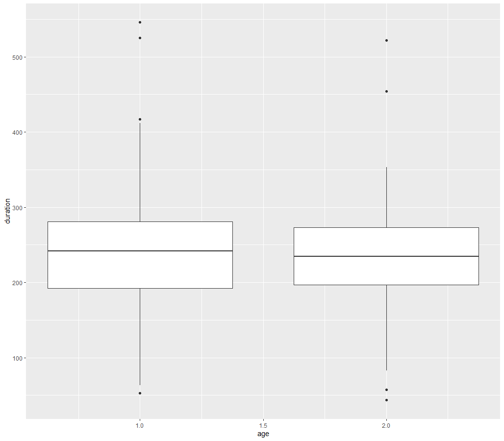
  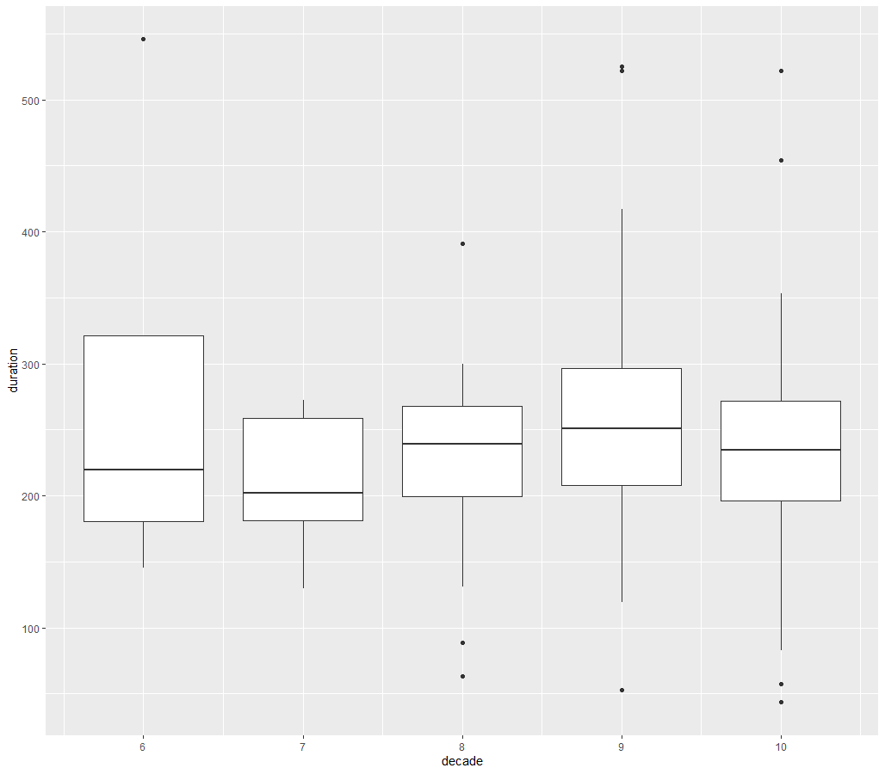

    Another interesting observation I have noticed is that the variable loudness is increasing every decade since the 70's.

    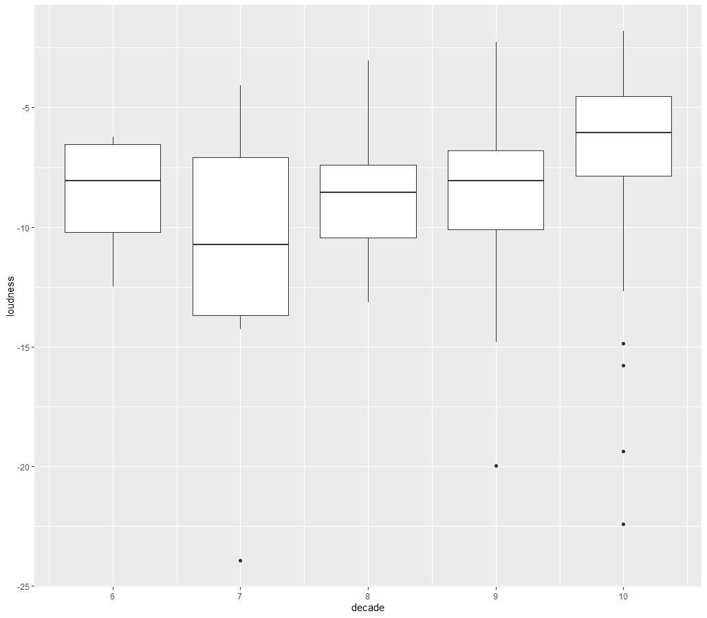

    In a nutshell, either in China or Europe, there is the region difference existed. Evidently, regarding genre of music, Chinese artist prefer pop and rock while European are inclined to electronic and alternative/classic rock. Moreover, female Chinese artists are the representative given more concerns while young artists of European draw more attentions from the public.

- Which are the characteristics of the songs I like? 
  - In order to compare music features of songs I like and don't I wanted to use a Spider Graph, in the following you can have an insight of which feature I appreciate the most.

    As we can see, there are no disrupting differences in the two graphs, but since every variable is compressed between 0 and 1, also minor changes could be significant.
    For example: *acoustics* is slightly higher in song that I didn't like while *instrumental ness* is slightly higher in the song I liked and so does *danceability*. Instead *valence* is harder to interpret since it's an overall score of the song, in this case it could mean that I like song with a higher overall score made by Spotify itself.

    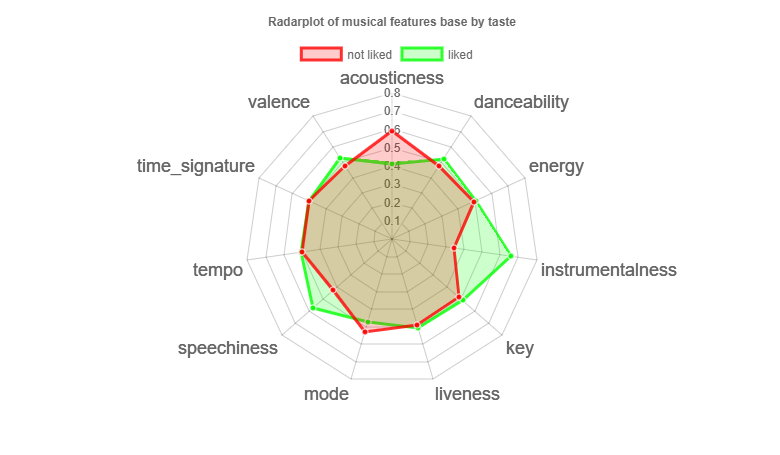

    ## Fitting the glm model

    After having the data separated we're fitting a `glm()` model:

    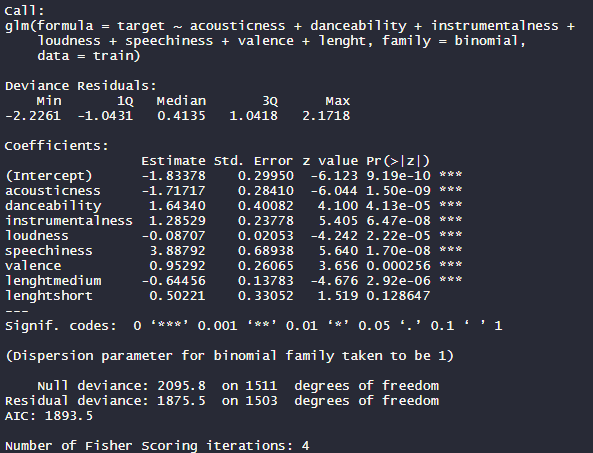

    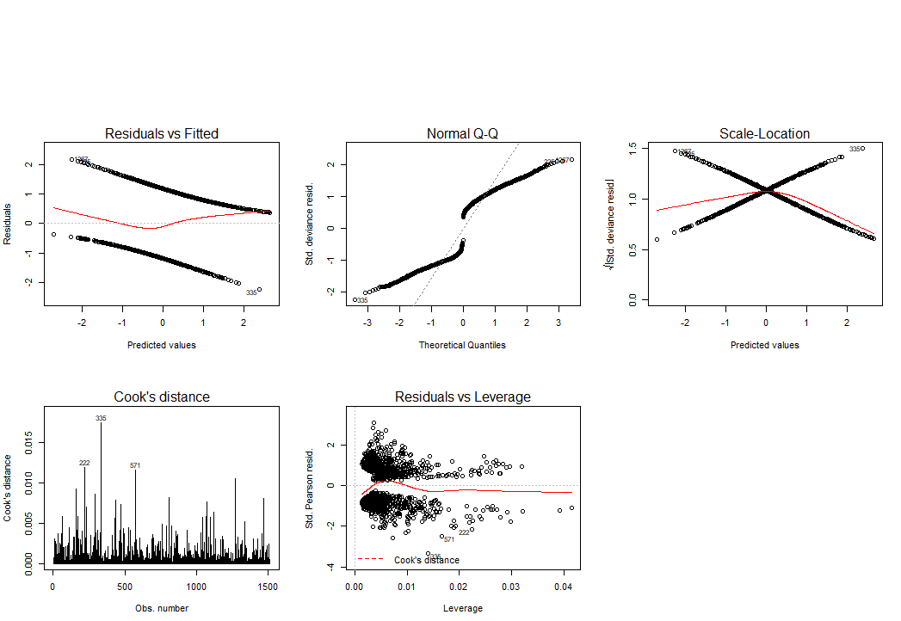

    The graphs show what looks like a good classification model, with residuals clearly distributed on two lines, no normality, but it's normal since the residuals and the model is supposed to be **binomial**, and few outliers that don't look like to be influential observation as we can see from the **Residuals vs Leverage** graph.

    The prediction made by fitting this model can be summarized in the following table:

    

    Looking at GoF parameters it looks like a good fit since the ratio between Residual Deviance and DoF it's close to 1.
    We can use this model to make a prediction and the next step would be training an ML algorithm to predict the results and compare them.
- How do the features of music influence the genre of music? 
  - Naive Bayes Model

    For the machine learning model, **naive bayes model** is chosen because it's used for classification with strong independence of features. For this prediction model, the label is the response variable and the other features are predictor variables. So here the input data is the divided into **x** and **y** for the training data and testing data as well.

  ``  {r, echo = FALSE, warning=FALSE}
   `` nbModel <- train(x,y,
     ``trControl=train_control,
       ``method="nb",
         ``preProc = preProcessInTrain 

    To process the data, the *center* and *scale* method is applied for the standardization of data.

    Predict the label by the NB model and get the confusion matrix

    After building the model, we need to predict the label by the test data. And the predictions and y test data can be compared in the **confusion matrix**.The model shows an accuracy of 50% which is not high. The reason is because the dataset is relatively small and the features are not very relative for some genre of labels which can be seen in the sensitivity index for different classes of label.

    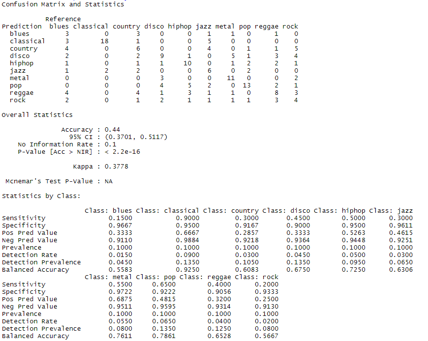

    The processed confusion matrix can be plotted as heatmap. In the heatmap, the number shows the percentage of the predicted number of label for the whole reference number of each label. The diagonal shows the percentage of accuracy for each genre of music.   

    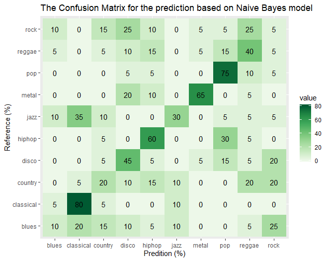

    From the plot, we can see the prediction for the genre of **classical** and **pop** is highly ***accurate*** which are highly influenced by the features of music. Besides, the **disco**, **rock** and **country** genres share high similarity in the features. The accuracy of **hiphop** and **metal** prediction is also good but still shares some similarity with other genre of music. Therefore, the musical features can decide only a part of the genre of music. There are more predictor variables needed.

    PC: Since the naive bayes model is a probability model, the output data may change slightly each time but it doesn't influence the conclusion.

### Discussion and Future Work

* In the naive bayes prediction model, the accuracy of predictions is only 48%. We can't see a direct relationship between these musical features and its label. The reason has two aspects. Firstly, small dataset as mentioned before is not very enough for machine learning model especially with classification problem. Secondly, the musical features actually have some iterations such as **tempo** and **beats** have strong linear relationship. the other features also have some collinearity which is not good for the model training sometimes. Meanwhile, the musical features are only part of the feature of the genre of the music, sometimes, it's decided also by the singer and the times.

  To better solve this problem, in the future, we can add more variables such as singer, rhythm, lyrics and other related variables to give more aspects to predict the model. Besides, as time passed by, the musical features related to genres may change accordingly. The analysis beyond different periods of time may also have a difference, so the created time of the data we used also is concerned during future analysis.
